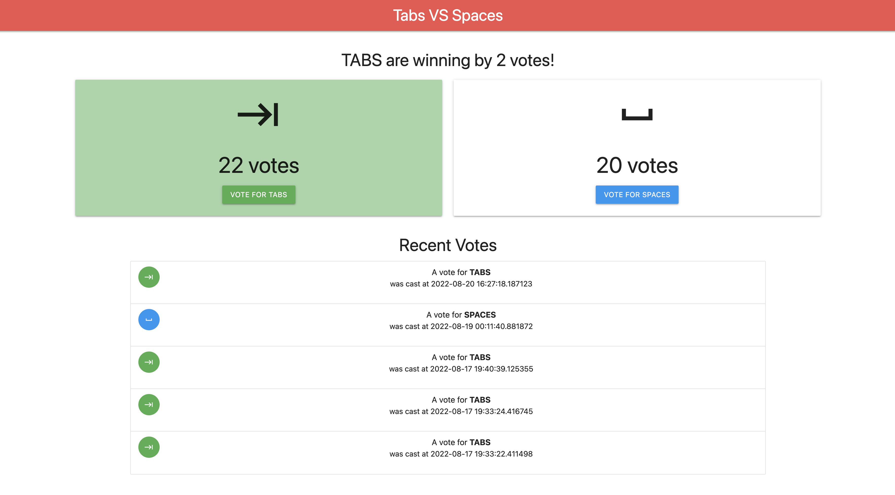

# :bar_chart: :computer: Tabs vs Spaces (Beginner)
A voting web application that aims to settle the age old programming debate, should you use Tabs or Spaces?

<p align="center">
    
</p>

## Before you begin

### Code Installation
Download the code for this tutorial.

1. Clone the repository using Git and change directories to `tabs-vs-spaces` folder.
```sh
git clone https://github.com/jackwotherspoon/cloud-sql-fastapi.git
cd cloud-sql-fastapi/tabs-vs-spaces
```

### Set up Cloud SQL database
1. Create a Postgres Cloud SQL Instance by following these 
[instructions](https://cloud.google.com/sql/docs/postgres/create-instance). 

Note the __connection string__, __database user__, and __database password__ that you create.

2. Create a database for your application by following these 
[instructions](https://cloud.google.com/sql/docs/postgres/create-manage-databases). 

Note the __database name__. 

3. Create a service account with the `Cloud SQL Client` IAM role by following these 
[instructions](https://cloud.google.com/sql/docs/postgres/connect-external-app#4_if_required_by_your_authentication_method_create_a_service_account).

Download the JSON key for the service account to authenticate your connection for local development.

## Running locally
To run this application locally on your machine:

1. Install the dependencies
```sh
pip install -r requirements.txt
```

2. Fill in the `.env` file with your Cloud SQL specific values and path to service account JSON key.
```
INSTANCE_CONNECTION_NAME="project-id:region:instance-name"
DB_USER="my-db-user"
DB_PASS="my-db-pass"
DB_NAME="my-database"
GOOGLE_APPLICATION_CREDENTIALS="path/to/keys.json"
```

3. Run the application
```sh
uvicorn app.main:app --reload
```

The application is now running locally! Point your web browser at http://127.0.0.1:8000/ to view it.

**Note:** Remember to remove the `--reload` when not in a development environment.
It helps a lot during development, but you shouldn't use it in production.

## Deploy to Cloud Run
The application can be deployed to [Cloud Run](https://cloud.google.com/run) through the following steps:

1. Build the container image

Replace `<PROJECT_ID>` with your Google Cloud Project ID.
```sh
gcloud builds submit --tag gcr.io/<PROJECT_ID>/cloud-sql-fastapi
```

2. Deploy the service to Cloud Run
Replace environment variables with the correct values for your Cloud SQL
instance configuration as well as service account email of previously created service account.
```sh
gcloud run deploy cloud-sql-fastapi --image gcr.io/<PROJECT_ID>/cloud-sql-fastapi \
  --service-account='<SERVICE_ACCOUNT_EMAIL>' \
  --set-env-vars INSTANCE_CONNECTION_NAME='<PROJECT_ID>:<INSTANCE_REGION>:<INSTANCE_NAME>' \
  --set-env-vars DB_USER='<YOUR_DB_USER_NAME>' \
  --set-env-vars DB_PASS='<YOUR_DB_PASSWORD>' \
  --set-env-vars DB_NAME='<YOUR_DB_NAME>'
```

Take note of the URL output at the end of the deployment process.s
This is the endpoint for your FastAPI application!

### Private IP Cloud SQL Connections
The application can also be deployed to Cloud Run using Private IP Cloud SQL connections.
Private IP allows your database to not be accessible from the public internet. 

First make sure your Cloud SQL instance is configured to have a Private IP address.
([Configure Private IP for Cloud SQL](https://cloud.google.com/sql/docs/postgres/configure-private-ip))

Private IP Cloud SQL instance(s) should be connected to a [VPC Network](https://cloud.google.com/vpc/docs/using-vpc)
which can be accessed securely via Cloud Run using [Serverless VPC Access](https://console.cloud.google.com/networking/connectors)
which creates a VPC Connector.

The VPC Connector can be attached to your Cloud Run service to allow Private IP
connections to the Cloud SQL instance on the **same VPC Network**.

```sh
gcloud run deploy cloud-sql-fastapi --image gcr.io/<PROJECT_ID>/cloud-sql-fastapi \
  --service-account='<SERVICE_ACCOUNT_EMAIL>' \
  --vpc-connector='<VPC_CONNECTOR_NAME>' \
  --set-env-vars INSTANCE_CONNECTION_NAME='<PROJECT_ID>:<INSTANCE_REGION>:<INSTANCE_NAME>' \
  --set-env-vars DB_USER='<YOUR_DB_USER_NAME>' \
  --set-env-vars DB_PASS='<YOUR_DB_PASSWORD>' \
  --set-env-vars DB_NAME='<YOUR_DB_NAME>' \
  --set-env-vars PRIVATE_IP=True
```

The application is now deployed using Private IP database connections!
